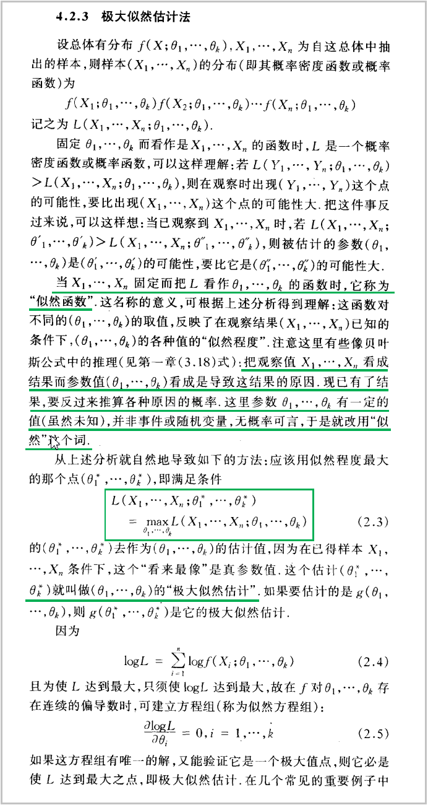

# DataProcBeginner
入门文本处理和分析，包括且不限于：文本挖掘、自然语言处理（统计学基础&深度学习inNLP&常见应用）、机器学习（分类等）。  
**（原创笔记）**

## Book《深度学习入门之PyTorch》
书中所有代码：[code-of-learn-deep-learning-with-pytorch](https://github.com/L1aoXingyu/code-of-learn-deep-learning-with-pytorch)  
参考此书和作者的代码，对部分实现（Logistic Regression、RNN）等重新编排成笔记： [deep_learning_with_pytorch_note](./deep_learning_with_pytorch_note/)。  
此书亮点： 1，循序渐进，而且有对应的pytorch代码（jupyter notebook的形式 + Python3） 2，全是干货，理论&code   
通过看书看代码有几点感受：
- 同样也听了一些很好的开源课，但欠缺自我思考、总结，也就是没有主动学习，偏被动学习，只有听，没有思考和实践。所以这些理论知识对我而言是悬浮的，没有稳固的基础。
- 眼高手低，缺乏实践，这不是好的学习方法。
- Tips：后续如果再听开源课时，通过实际行动改变这种被动学习的惰性。  

注：已经完成这本入门书的第一次学习。(done~2019/5/8)

## HSE-Natural Language Processing-Coursera
俄罗斯国立高等经济大学的[自然语言处理课程](https://www.coursera.org/learn/language-processing)  
本课程适合对自然语言处理（机器学习、NLP常见应用）有一定了解的人学习。课程简洁明了，短小精悍，既包含对理论的介绍，也有很多应用、实践，尤其是课程的作业。  
课程笔记：[HSE_NLP_Note](./hse_nlp)  
课程简介如下，包括：传统NLP、深度学习、文本分类、语言模型、序列标注、语义表示、对话系统等。
- Week 1，Intro and text classification
- Week 2，Language modeling and sequence tagging
- Week 3，Vector Space Models of Semantics
- Week 4，Sequence to sequence tasks
- Week 5，Dialog systems  

注： 本课程是 高级机器学习 专项课程的一部分(a part of Advanced Machine Learning of National Research University Higher School of Economics)，可参考Coursera课程页面。

## 文本挖掘与分析
课程&学习笔记：[text-mining-and-analytics-coursera](./text-mining-and-analytics-coursera/README.md)

## SVM（支持向量机）
- **强烈推荐：[SVM Tutorial](https://www.svm-tutorial.com/)**   
通过认真通读这本电子书，对SVM有了比较清晰的理解，虽然公式会淡忘。这主要是因为这本书从最基础的数学和问题出发，沿着很清晰的脉络，循序渐进的讲解：问题是什么？为什么要这么做？怎么做。所以对穿插其中的很多数学公式和理论就不那么糊涂了。
- 在读了前面提到的这本书之后，再去读任何SVM的中文技术博客，都很容易理解。  
此处推荐也很不错的一篇文章：[学习SVM，这篇文章就够了！](https://mp.weixin.qq.com/s?__biz=MzI4MDYzNzg4Mw==&mid=2247487755&idx=1&sn=22b1e130bdbf8657b61aba492fdc6b7d&chksm=ebb429dfdcc3a0c95b4dd6281639277b165cfdd28234e45cb3f2feb8d2158e50e951d681524c&mpshare=1&scene=24&srcid=02223jFOWQgkXSTxor58Tvgt#rd)
- **代码实践**  
借鉴开源代码或工具，用三种方式实现SVM，作为练习。分别是：①SVM的python实现；②sklearn；③libsvm。
ongoing

## 词向量
常常听到词向量、word2vec，其实两者不是一回事。  
**神经网络模型生成的词表示通常被称为词向量(word embedding)**，而Word2Vec是Google于2013年发布的一个用于获取Word Embedding的工具包。  
作为一个小白，最开始着重理解这几点：  
> - 词向量是什么？理论发展过程、优点、用途等  
①词向量是由神经网络模型得到的低维实数向量表示，对上下文、以及上下文与目标词之间的关系进行建模，因此在词向量中包含更丰富的语义信息。  
②从历史上看，早期的词向量只是神经网络语言模型的副产品。词向量的发展，先是有几种神经网络语言模型，然后发展为专门用于生成词向量的神经网络模型。  
③具体发展过程介绍（略），优点、用途（略，待后续实践具体应用）  
> - word2vec的基本工作原理  
①word2vec是训练词向量的一个工具包。  
②word2vec的训练方法有两种模型。同时，为了优化计算效率，又有两种优化方法。  
③简单了解两种模型：CBOW & Skip-gram。暂时略去两种优化方法：Hierarchical Softmax & Negative Sampling。  
> - 汇总介绍：[自然语言处理(四)神经网络语言模型及词向量](https://cloud.tencent.com/developer/article/1384565)

阅读了以下资料，都是干货。
- [word2vec概述](http://jermmy.xyz/2017/11/03/2017-11-3-word2vec-introduction/)  
  - Count Vector没有语义信息，很难用基于频率的方法体现词之间的相似性。  
  - 什么是词的语义呢？***词的语义由其上下文决定，上下文相似的词，其语义也相似。*** word2vec基于语料库，训练一个神经网络，用网络的参数作为文本的特征。word2vec有CBOW和Skip-gram两种模型进行训练。  
  - CBOW用上下文（上下文各词词向量的平均值）预测目标词，神经网络的结构很简单，输入层（V\*1）+隐藏层+softmax输出层(V\*1)，其中输出层中概率最大的位置，对应了目标词在one-hot向量中的位置。输入层-隐藏层的权重矩阵为W1(N\*V)，上下文各个词在隐藏层的输出的平均值作为最终的隐藏层，利用了上下文，**隐藏层-输出层的权重矩阵W2（V\*N）。训练结束后，W2矩阵就是词向量，每一行代表了一个词的向量表示。**  
  - Skip-gram用上下文中某一个词预测上下文，神经网络结构与CBOW相同。最后**输入层-隐藏层的权重矩阵就是词向量。**

- **[word2vec 中的数学原理详解](https://www.cnblogs.com/peghoty/p/3857839.html)**，写得非常好，收获很大！（P.S.也想有这种弄懂了一个知识点之后的写作风格）  
从目录就可以看出这篇文章的行文思路非常清晰，很适合本人这种小白阅读。同时，也提醒自己，**要把对机器学习、深度学习、统计学、NLP中的语言模型等的理解和各个知识点串联起来，形成自己的知识体系，有比较系统的知识框架**。做到这一点，才能把自己和别人讲明白，真正做到能够分享知识的水平。  
该文已经存档，存放在doc/目录，后续不断深入理解和学习。  

  

- [来斯惟. 基于神经网络的词和文档语义向量表示方法研究[D]. 2016.](https://arxiv.org/abs/1611.05962)

## 贝叶斯公式 & 最大似然估计 & 最大后验概率估计
 - 参考资料  
[贝叶斯估计、最大似然估计、最大后验概率估计](https://www.jianshu.com/p/9c153d82ba2d)  
[最大似然估计](https://mp.weixin.qq.com/s?__biz=MzI4MDYzNzg4Mw==&mid=2247487202&idx=1&sn=1f3c22a6e16f5611cfe92356ccc0ff74&chksm=ebb43636dcc3bf20892295a5570ed89a533172ad557b2bcf2925ba6848dfacfcf7997d18691d&scene=21#wechat_redirect)  
[最大后验概率估计](https://mp.weixin.qq.com/s?__biz=MzI4MDYzNzg4Mw==&mid=2247487221&idx=2&sn=3f8b6a65276f34adb9ee35322ace7d09&chksm=ebb43621dcc3bf37d3708be73bb1945f579992bbc05358157f46d23b48713768332db8431639&scene=21#wechat_redirect)  

- 概率（probabilty）V.S. 统计（statistics）  
概率研究的问题是，已知一个模型和参数，怎么去预测这个模型产生的结果的特性（如均值，方差，协方差等）。统计研究的问题则相反。统计是，有一堆数据，要利用这堆数据去预测模型和参数。  
**概率是已知模型和参数，推数据。统计是已知数据，推模型和参数。  
最大似然估计和最大后验概率估计都是统计领域的问题，都是用来推测参数的方法。**  

- 贝叶斯公式  
在已知B事件发生的情况下A事件发生的概率，即AB两事件的交集除以B事件发生的概率。
  
  - P(A)是A的**先验概率**（Prior probability）或边缘概率。之所以称为"先验"是因为它不考虑任何B方面的因素，在B事件发生之前，对A事件概率的一个判断。
  - P(A|B)是已知B发生后A的条件概率，也由于得自B的取值而被称作**A的后验概率**（Posterior probability），表示事件B发生后，事件A发生的置信度。
  - P(B|A)是已知A发生后B的条件概率，也由于得自A的取值而被称作B的后验概率，也被称作**似然函数**。
  - P(B)是B的先验概率或边缘概率，也作标准化常量（normalized constant）。
  - **P(B|A)/P(B)是标准似然度**（standardised likelihood），表示事件B为事件A发生提供的支持程度。   

>**Bayes法则可表述为：  
>后验概率 = 似然函数 \* 先验概率 / 标准化常量  
>后验概率 = 标准似然度 \* 先验概率**  

- 似然函数与概率函数  
在英文中，似然（likelihood）和概率（probability）是同义词，都指事件发生的可能性。**但在统计中，似然与概率是不同的东西。概率是已知参数，对结果可能性的预测。似然是已知结果，对参数是某个值的可能性预测**。     
对于函数P(x|θ)，从不同的观测角度来看可以分为以下两种情况：
  - 如果θ已知且保持不变，x是变量，则P(x|θ)称为概率函数，表示不同x出现的概率。
  - 如果x已知且保持不变，θ是变量，则P(x|θ)称为似然函数，表示不同θ下，x出现的概率，也记作L(θ|x)或L(x;θ)或f(x;θ)。

- 最大似然估计 & 最大后验概率估计  
最大似然估计(Maximum Likelihood Estimation, 简写为MLE，又称极大似然估计)，最大后验概率估计(Maximum A Posteriori Estimation，简写为MAP)。   
    

## 生成模型与判别模型
- 基本概念和区别  
  - 监督学习方法可以分为生成方法(generative approach)和判别方法(discriminative approach)。所学到的模型分别为生成模型(generative model)和判别模型(discriminative model)。  
  - 生成方法由数据学习 **联合概率分布P(X,Y)**，然后求出条件概率分布P(Y|X)=P(X,Y)/P(X)作为预测的模型。典型的生成模型有：朴素贝叶斯法、马尔科夫模型、高斯混合模型。  
  - 判别方法由数据直接学习决策函数f(X)或者 **条件概率分布P(Y|X)** 作为预测的模型，即判别模型。典型的判别模型包括：k近邻法、感知机、决策树、逻辑斯蒂回归模型、最大熵模型、支持向量机、boosting方法和条件随机场等。

- 概率图模型  
监督学习的两个核心问题：分类问题和标注问题。可以认为标注问题是分类问题的一个推广。   
可以从概率图的角度来理解几个常见模型的区别。暂不列出各个模型的深入描述。
  - NB，朴素贝叶斯模型，联合概率分布，生成模型，用于分类问题
  - HMM，隐含马尔科夫模型，联合概率分布，生成模型，用于标注问题，是NB的一个推广
  - ME，最大熵模型，条件概率分布，判别模型，用于分类问题
  - CRF，条件随机场，条件概率模型，判别模型，用于标注问题，是ME的一个推广  

  

- 参考资料
  - 李航. 统计学习方法[M]. 清华大学出版社, 2012.
  - [机器学习“判定模型”和“生成模型”有什么区别？](https://www.zhihu.com/question/20446337)
  - [【机器学习基础】生成模型和判别模型](https://www.jianshu.com/p/d195b887a32e)
  - Klinger, R & Tomanek, K. (2007). Classical Probabilistic Models and Conditional Random Fields. Tech Rep TR07-2-013.

## 最大熵模型
ongoing

## Reading
- **《数学之美》**  

- **《概率论与数理统计》陈希孺**  
这本书通俗易懂，从中学习了几个非常基础的概念，特别是在学习模型时会涉及的几个统计学定义。
  - 条件概率  
 
  - 贝叶斯公式  
 
  - 极大似然估计  
 
  - 贝叶斯学派（**先验概率 & 后验概率**），用了很多篇幅来描述贝叶斯学派的思想，非常好理解。
