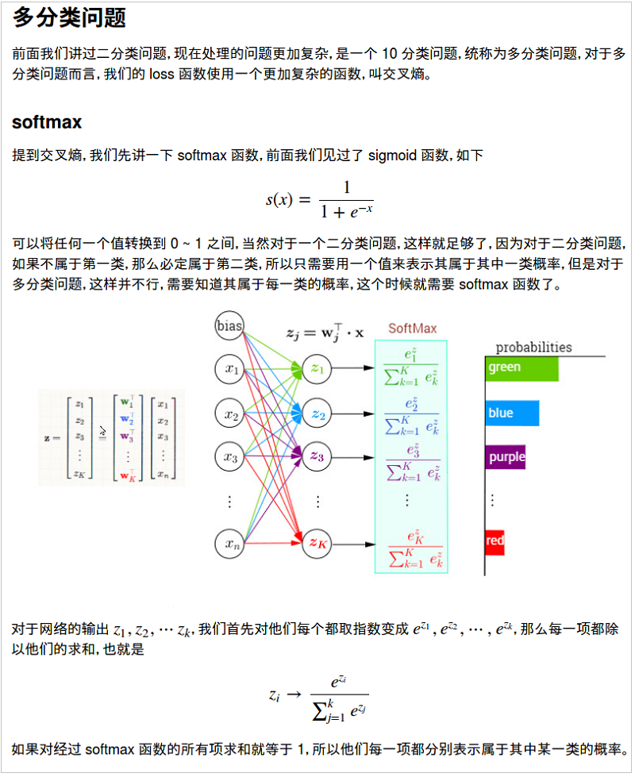

### 《深度学习入门之PyTorch》Note
Jupyter Notebook + Python 3，理论+code。  

------
### 深度学习的历史
- Year 1958~1969，单层感知机(Perceptron)，本质是线性模型，只能处理线性分类问题。研究停滞近二十年。
- Year 1986~1998，多层感知机引入Sigmoid非线性映射 + 反向传播算法(BP算法) >> 万能逼近定理。但是BP+Sigmoid存在梯度消失问题。
- Year 1986~2006，统计学习方法盛行，比如SVM、概率图模型等机器学习方法。
- Year 2006~2011，ReLU激活函数被提出，能够抑制梯度消失的问题，并且加快了收敛速度。深度学习应用到语音识别，有重大突破。
- Year 2012~Now，<br>1，2012年，CNN在ImageNet比赛上夺冠；<br>2，深度学习的网络结构、训练方法、理论、GPU硬件等不断进步，神经网络可以做到多层，成为真正的"深度"学习。
- [为什么引入ReLU函数？为什么ReLU函数可以抑制梯度消失的问题？](https://blog.csdn.net/u014114990/article/details/50144653)
  - 第一，采用Sigmoid等函数，反向传播求梯度时，求导计算量很大，而ReLU求导非常容易；
  - 第二，对于深层网络，Sigmoid函数反向传播时，很容易就会出现梯度消失的情况（在Sigmoid接近饱和区时，变换太缓慢，导数趋于0），从而无法完成深层网络的训练；
  - 第三，ReLU会使一部分神经元的输出为0，这样就造成了网络的稀疏性，并且减少了参数的相互依存关系，缓解了过拟合问题的发生。

------
### PyTorch基础
```
## python 3
import torch

# Tensor，张量，多维矩阵，和numpy对应且可以相互转换
a = torch.Tensor([[1, 2], [5, 3], [6, 8]])
b = torch.zeros((3, 2)
print(format(a))  # tensor([[1., 2.], [5., 3.], [6., 8.]])

# Variable，变量，在计算图中，有三个属性：data, grad和grad_fn
# data: Variable中的tensor，grad: 反向传播梯度，grad_fn: 得到此Variable的操作
from torch.autograd import Variable
x = Variable(torch.Tensor([1]), requires_grad=True)
w = Variable(torch.Tensor([2]), requires_grad=True)
b = Variable(torch.Tensor([3]), requires_grad=True)
# build a computational graph
y = w * x + b
# 自动求导
y.backward()
print(x.grad, w.grad, b.grad)  # tensor([2.]) tensor([1.]) tensor([1.])

# nn.Module，神经网络模组，所有模型的构建都是用基类nn.Module
# 构建的模型相当于一个计算图，可复用，
# 只需要定义变量和前向传播，PyTorch有自动求导功能，无需编写反向传播部分
from torch import nn
class LogisticRegression(nn.Module):  # 自定义神经网络的名称
    def __init__(self):
    ...

    def forward(self, x):
    ...

```

------
### 多层全连接神经网络
[线性回归模型和梯度下降](./ch3_nn/linear-regression-gradient-descend.ipynb)  
[分类器：Logistic回归模型](./ch3_nn/logistic-regression/logistic-regression.ipynb)  
[神经网络简介，PyTorch构建nn模型的两个模块: Sequential和Module](./ch3_nn/nn-sequential-module.ipynb)  
[反向传播算法](./ch3_nn/bp.ipynb)  
梯度下降法的变式，默认的优化算法为Adam。  
[实现MNIST手写数字的多分类问题：softmax、交叉熵、PyTorch实现](./ch3_nn/deep-nn.ipynb)  
  
  
>小结：1，理论要弄明白、透彻；2，实践必不可少。这两点是之前缺乏的，特点就是只听课，不看书、不复习、不实践。

------
### 卷积神经网络CNN
CNN在图像分类、图像增强上的应用 with PyTorch（略）  
另，生成对抗网络(GAN)和增强学习(RL)的相关内容，也暂时省略。

------
### 循环神经网络
循环神经网络，Recurrent Neutral Network，RNN  
长短时记忆网络，Long Short Term Memory Network, LSTM  
[RNN+LSTM+PyTorch](./ch5_rnn/pytorch-rnn.ipynb)  
[PyTorch实现RNN/LSTM中的参数介绍-1](https://pytorch-cn.readthedocs.io/zh/latest/package_references/torch-nn/#recurrent-layers)  
[PyTorch实现RNN/LSTM中的参数介绍-2](https://pytorch.org/docs/stable/nn.html#recurrent-layers)   
RNN的难点在于结构复杂，不能像之前的其他深度学习模型那样很容易的理解**RNN的前向计算和反向传播**。  
**自己参考了一些资料，整理成笔记：[rnn_lstm_note](../rnn_lstm/README.md)**  

------
### 实践：Neural Transfer with PyTorch，迁移学习
官方参考资料：[PyTorch Tutorial Neural Style Transfer](https://pytorch.org/tutorials/advanced/neural_style_tutorial.html)  
自己动手：1，收集试验图片；2，下载预训练模型vgg19；3，训练和试验。  
***修改后的notebook***：[neural_style_tutorial_notebook](./neural_transfer_pytorch/neural_style_tutorial_revision.ipynb)  
**试验结果如下，其中：第一排为结果，第二排为原始图片，第三排为风格图片。  
第一列和第三列：相同的风格，第二列和第三列：相同的原始图片，互为对照。**    
  
还是很有意思的~。后续可以找到更多有趣的照片继续试验。  
其中遇到的问题有：
- 没有GPU，所以图片大小只能为128，分辨率略低。若有GPU，图片大小为512；
- 收集的图片为4通道，会报错，最终定位为图片通道问题，加入两行代码即可；
- 最好先下载预训练模型vgg19：vgg19-dcbb9e9d.pth，大小为549M，下载完成后放入模型的默认位置：{root_dir}/.torch/models/

------
### 实践：NLP—语言模型(N-Gram, 词向量)，LSTM for POS Tagging
用PyTorch实现基于LSTM的词性标注模型  
[RNN-NLP-PyTorch](./ch5_rnn/nlp/)  
更多资料可以参考官网Tutorials：  
[Sequence Model](https://pytorch.org/tutorials/beginner/nlp/sequence_models_tutorial.html#sphx-glr-beginner-nlp-sequence-models-tutorial-py)  
[中文讲解版-Sequence Model](https://www.pytorchtutorial.com/pytorch-sequence-model-and-lstm-networks/)
